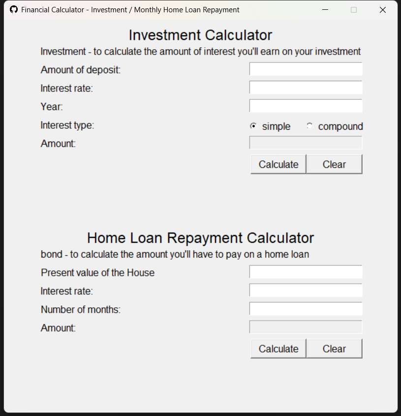

## Finance Calculators GUI  
:arrow_right: (<a href="http://bit.ly/3ItFKDM" target="_blank">Preview</a>)


### Introduction

This application includes two calculators with a graphical user interface (GUI), which are divided into two sections of the window. The upper section is for calculating simple or compound interest, and the lower section is for calculating monthly home loan repayments. Both calculators can be accessed using the buttons at the bottom of the window.

<p align="center"></p>

### Getting Started
These instructions will get you a copy of the project up and running on your local machine for development and testing purposes.

#### Prerequisites
This application requires Python 3.6 or higher, as well as the following libraries:
- <a href="https://www.python.org/" target="_blank">Python</a>
- <a href="https://docs.python.org/3/library/tkinter.html" target="_blank">tkinter</a>

```
pip install tkinter
```

#### Installation

To get started with the financial calculators, follow these steps:

1. **Clone** the repository:
```
git clone https://github.com/cwchan0212/hyperiondev-capstone1.git
```
2. **Navigate** to the project directory:
```
cd hyperiondev-capstone1/
```
3. Run the **finance_calculator_gui.py** file:
```
python finance_calculator_gui.py
```

### File Structure
- **finance_calculator_gui.py**: Main program file containing functions to perform various tasks.


### Usage
**Investment Calculator**

To use the **Investment Calculator**, enter the following values in the upper section of the window:

- **Deposit amount:** the initial amount of money invested or borrowed
- **Interest rate:** the annual interest rate as a percentage
- **Number of years:** the number of years over which the interest will be calculated
- **type of interest:** use the radio buttons labeled **Simple** and **Compound** to choose between simple and compound interest

To calculate the total amount of interest earned or paid, click the **Calculate** button. To clear the form and start over, click the **Clear** button.

If the user enters an **invalid input** (e.g. a non-numeric value or a negative number), an error message will be displayed and the field in question will be set in focus.

The **simple interest** formula is **A = P (1 + r x t)**, where
* A = final amount (principal + interest)
* P = initial principal balance
* r = annual interest rate
* t = time (in years


The **compound interest** formula is **A = P [(1 + r/n)]^(n x t)**, where
* A = final amount (principal + interest)
* P = initial principal balance
* r = interest rate
* n = number of times interest is applied per period
* t = number of periods elapsed

---

**Home Loan Calculator**
To use the **Home Loan Calculator**, enter the following values in the lower section of the window:

* **Present value of the house:** the total amount of the loan
* **Interest rate:** the annual interest rate as a percentage
* **Number of months:** the length of the loan

If the user enters an **invalid input** (e.g. a non-numeric value or a negative number), an error message will be displayed and the field in question will be set in focus.


To calculate the monthly loan repayment amount, click the **Calculate** button. To clear the form and start over, click the **Clear** button.

The **monthly repayment amount** formula is **p = r x PV / (1 - (1 + r)^ - n)**, where
* p = monthly repayment amount
* PV = present value of the house
* r = rate per period
* n = number of periods

### Notes
The calculators include **input validation** to prevent the user from entering invalid values.
The calculators do not currently support negative interest rates or negative loan amounts.

### Acknowledgments
This projects were inspired by <a href="https://www.hyperiondev.com/" target="_blank">HyperionDev</a>